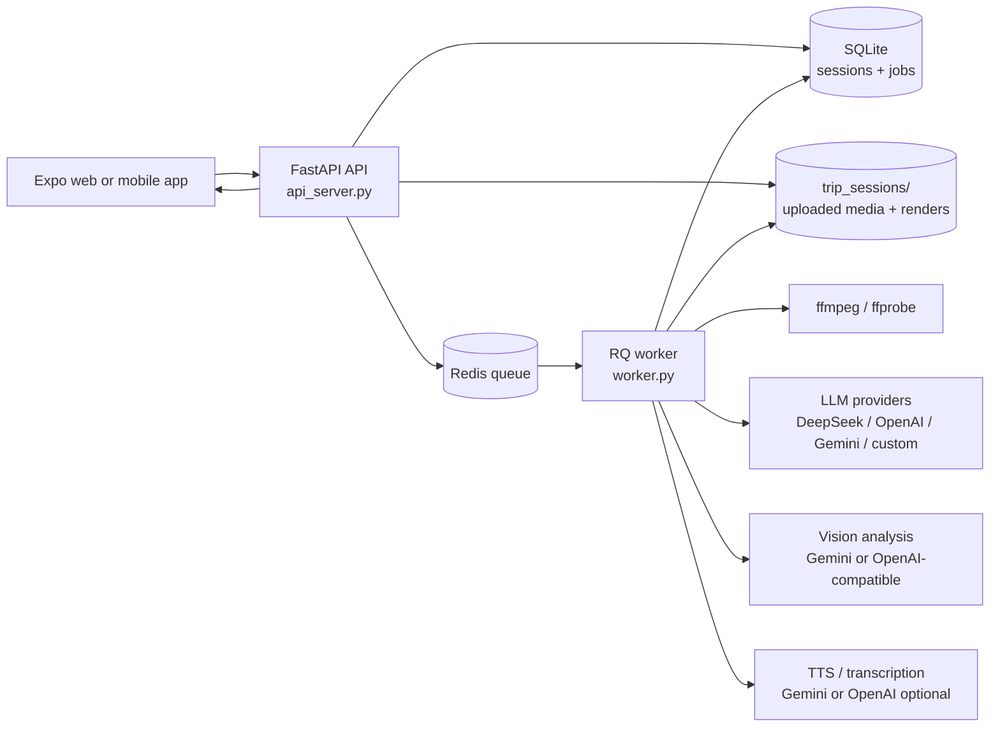
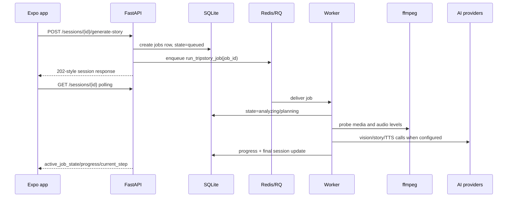

# TripStory AI: Multilingual Holiday Recap Studio

TripStory AI turns a pile of holiday clips into a polished travel recap plan and stitched video.

## Companion Documents
For deep technical and product context regarding the architecture design, refer to:
- [PRD.md](PRD.md): Product vision, target audience, and MVP milestones.
- [SCHEMA.md](SCHEMA.md): Core JSON contracts (Scene Memory, Story Plan).
- [PROMPTS.md](PROMPTS.md): VLM and LLM system prompts.
- [API_SPEC.md](API_SPEC.md): REST API contracts.
- [EVAL_PLAN.md](EVAL_PLAN.md): Evaluation metrics for narrative coherence and narration restraint.

The new product flow is:

1. Upload clips and videos from a trip.
2. Answer context questions:
   - Where did you go?
   - How long was the trip?
   - Which places did you visit?
   - Who was there?
   - What moments mattered most?
   - What language and tone should the voiceover use?
3. Generate a multilingual narrative arc, edit notes, and voiceover script.
4. Render a simple final recap video from the uploaded clips.

The LLM layer is vendor-neutral. By default the app works with a deterministic fallback, and the backend can use OpenAI, Gemini, or DeepSeek from server-side environment variables.

---

## Architecture



The API remains responsive during story generation and rendering. It creates a job row in SQLite, enqueues the job in Redis/RQ, and the frontend polls `/sessions/{session_id}` for `phase`, `screen`, `progress_percent`, and active job details.



## Key Files

| File | Purpose |
|------|---------|
| `api_server.py` | FastAPI app for trip sessions, media upload, story generation, and rendering |
| `worker.py` | RQ worker entrypoint for queued story and render jobs |
| `llm_provider.py` | Vendor-neutral OpenAI-compatible chat client |
| `media_intelligence.py` | ffprobe/ffmpeg/OpenCV clip analysis and optional frame vision/transcription |
| `trip_story.py` | Multilingual narrative and voiceover generation |
| `trip_renderer.py` | Lightweight video assembly from uploaded clips |
| `tripstory_logging.py` | Structured API/worker logging helpers |
| `mobile/App.tsx` | Expo mobile UI for the TripStory workflow |
| `mobile/src/api.ts` | Mobile API client |
| `mobile/src/types.ts` | Trip session, context, media, and story types |

Legacy trend-analysis modules are still present in the repository for reference, but the active mobile/API product is now TripStory.

## Environment Setup

Recommended Miniconda setup from the repository root:

```bash
conda env create -p "$PWD/.conda/trendsync-py312" -f environment.yml
conda activate "$PWD/.conda/trendsync-py312"
python -m pip install -r requirements.txt
```

The Conda environment provides Python 3.12, `ffmpeg`, Node.js, and npm. Python package dependencies are installed with pip from `requirements.txt`.

If your shell has user-site Python packages visible, keep the Conda environment isolated while installing or running:

```bash
export PYTHONNOUSERSITE=1
```

## Run Redis, Worker, And API

Start Redis and the worker for queued story/render jobs:

```bash
redis-server
python worker.py
```

The Conda environment includes Redis. If using a plain venv, install/run Redis separately.

Keep the worker in the foreground while developing, or run it under a process supervisor. If you suspend the worker terminal with shell job control, the active worker child and any child `ffmpeg` process can stop and block the queue. The media probes are hardened with `-nostdin`, `stdin=DEVNULL`, and subprocess timeouts, but a stopped old worker must still be restarted.

Then start the API:

```bash
python -m uvicorn api_server:app --host 0.0.0.0 --port 8010
```

Optional LLM configuration:

```bash
cp .env.example .env
```

Edit `.env`, set `TRIPSTORY_LLM_PROVIDER=deepseek`, fill in `DEEPSEEK_API_KEY`, and fill in `GEMINI_API_KEY` for video-frame understanding. The API loads `.env` on startup. The frontend never receives or submits provider API keys.

Story generation uses the backend provider from `.env` by default. The Plan screen shows `Story brain` as `OPENAI`, `GEMINI`, or `DEEPSEEK` when the LLM produced the voiceover and smart edit decisions; if it shows `FALLBACK`, the panel explains which provider/key setting is missing or which API error occurred.

LLM calls are serialized server-side to avoid accidental concurrent requests. Tune retry/rate behavior with:

```bash
TRIPSTORY_LLM_MIN_INTERVAL_SECONDS=3
TRIPSTORY_LLM_MAX_RETRIES=2
TRIPSTORY_LLM_TIMEOUT=120
TRIPSTORY_STORY_MAX_TOKENS=4096
```

DeepSeek reasoning models can return an empty `content` field when the output budget is too small for the story-planning JSON, and can take longer than smaller chat models. Keep `TRIPSTORY_STORY_MAX_TOKENS` at `4096` or higher if the Plan screen reports an empty provider response, and keep `TRIPSTORY_LLM_TIMEOUT` around `120` seconds if DeepSeek times out.

Backend logs are structured as timestamped key/value JSON fields in the API and worker terminals. Optional logging controls:

```bash
TRIPSTORY_LOG_LEVEL=INFO
TRIPSTORY_LOG_HTTP_REQUESTS=1
TRIPSTORY_LOG_FILE=/tmp/tripstory.log
TRIPSTORY_LOG_API_PAYLOADS=0
```

With HTTP request logging enabled, session polling emits structured app-state fields such as `session_phase`, `session_progress_percent`, `active_job_state`, and `active_job_step` in addition to Uvicorn's access log. Set `TRIPSTORY_LOG_LEVEL=DEBUG` to include request-start records too.

Queued jobs older than `TRIPSTORY_STALE_JOB_SECONDS` are marked failed on the next session poll, so a lost Redis/RQ job does not leave the frontend spinner running forever.
SQLite connections use WAL mode with `TRIPSTORY_SQLITE_TIMEOUT_SECONDS=20` by default so the API and worker can share the local job/session database more reliably.
Media probing uses explicit ffmpeg timeouts so broken clips cannot occupy the only worker forever:

```bash
TRIPSTORY_FFMPEG_PROBE_TIMEOUT=30
TRIPSTORY_FFMPEG_AUDIO_TIMEOUT=45
TRIPSTORY_FFMPEG_RENDER_TIMEOUT=300
TRIPSTORY_FFMPEG_AUDIO_MIX_TIMEOUT=300
TRIPSTORY_FFMPEG_BIN=
TRIPSTORY_FFPROBE_BIN=
```

The renderer resolves `ffmpeg` and `ffprobe` from `PATH`, then from the active Python environment's `bin` directory. Set `TRIPSTORY_FFMPEG_BIN` and `TRIPSTORY_FFPROBE_BIN` only if your binaries live somewhere else.

Watch live logs in the terminals running `python -m uvicorn ...` and `python worker.py`, or follow the optional file:

```bash
tail -f /tmp/tripstory.log
```

To confirm provider calls are serialized, start one story generation and watch for one `llm_request_attempt` at a time followed by `llm_request_complete` or `llm_request_retry`. Narration uses the same pattern with `tts_request_attempt`.

Default models:

- OpenAI: `gpt-4o-mini`
- Gemini: `gemini-2.0-flash`
- DeepSeek: `deepseek-v4-pro`

You can also export the variables directly instead of using `.env`:

```bash
export TRIPSTORY_LLM_PROVIDER="openai"   # openai, gemini, deepseek, local, or custom
export OPENAI_API_KEY="your-openai-key"
```

Provider-specific key variables are `OPENAI_API_KEY`, `GEMINI_API_KEY`, and `DEEPSEEK_API_KEY`. Provider-specific model overrides are `TRIPSTORY_OPENAI_MODEL`, `TRIPSTORY_GEMINI_MODEL`, and `TRIPSTORY_DEEPSEEK_MODEL`.

Recommended DeepSeek + Gemini split:

```bash
export TRIPSTORY_LLM_PROVIDER="deepseek"
export DEEPSEEK_API_KEY="your-deepseek-key"
export TRIPSTORY_DEEPSEEK_MODEL="deepseek-v4-pro"
export TRIPSTORY_DEEPSEEK_THINKING="enabled"
export TRIPSTORY_DEEPSEEK_REASONING_EFFORT="high"
export GEMINI_API_KEY="your-gemini-key"
export TRIPSTORY_VISION_PROVIDER="gemini"
export TRIPSTORY_ENABLE_VISION_ANALYSIS=1
```

Narration uses server-side TTS when configured. Recommended Gemini TTS setup:

```bash
TRIPSTORY_TTS_PROVIDER=gemini
TRIPSTORY_TTS_MODEL=gemini-3.1-flash-tts-preview
TRIPSTORY_TTS_VOICE=Kore
TRIPSTORY_TTS_MIN_INTERVAL_SECONDS=3
TRIPSTORY_TTS_MAX_RETRIES=2
```

Gemini TTS uses `GEMINI_API_KEY` and writes `voiceover.wav`. OpenAI TTS is still supported with `TRIPSTORY_TTS_PROVIDER=openai`, `OPENAI_API_KEY`, `gpt-4o-mini-tts`, and an OpenAI voice such as `coral`.

Clip speech transcription is off by default because it sends extracted audio to OpenAI:

```bash
TRIPSTORY_ENABLE_TRANSCRIPTION=1
```

Sampled-frame visual understanding is enabled when `GEMINI_API_KEY` is present and `TRIPSTORY_ENABLE_VISION_ANALYSIS=1`. This adds one serialized Gemini vision request per uploaded clip so the DeepSeek story planner can see visible subjects, scenes, actions, best frame descriptions, and avoid reasons.

```bash
TRIPSTORY_ENABLE_VISION_ANALYSIS=1
TRIPSTORY_VISION_PROVIDER=gemini
TRIPSTORY_VISION_MODEL=gemini-2.0-flash
TRIPSTORY_VISION_MAX_FRAMES=3
TRIPSTORY_VISION_MIN_INTERVAL_SECONDS=3
```

For a custom OpenAI-compatible endpoint:

```bash
export TRIPSTORY_LLM_URL="http://localhost:8000/v1"
export TRIPSTORY_LLM_MODEL="your-model-name"
export TRIPSTORY_LLM_API_KEY="optional-key"
```

If `TRIPSTORY_LLM_URL` is not set, TripStory uses a local fallback that still returns a usable narrative plan.

## Run The Mobile App

```bash
cd mobile
npm ci
npm run web -- --clear --port 8081
```

Default API URL:

- iOS/Web: `http://localhost:8010`
- Android emulator: `http://10.0.2.2:8010`

## Current Output

TripStory renders a stitched recap video, analyzes uploaded clips, saves the generated story plan beside it as JSON, and mixes generated narration into the video when server-side TTS is configured.

## Operations Notes

Use three long-running processes locally:

| Process | Command | Responsibility |
|---------|---------|----------------|
| Redis | `redis-server` | Stores queued and started RQ jobs |
| Worker | `python worker.py` | Runs clip analysis, story planning, TTS, and render jobs |
| API | `python -m uvicorn api_server:app --host 0.0.0.0 --port 8010` | Serves the frontend, persists sessions, and reports job progress |

If the frontend spinner is stuck, check `/sessions/{session_id}` logs first. A healthy queued render behind another active job looks like `active_job_state=queued`. A blocked worker usually shows one old `started` RQ job, one busy worker, and no recent `job_progress` lines.

For ffmpeg-specific stalls, check process state. `STAT T` or `Tl` means the process is stopped by job control, not doing slow encoding. Restart the worker so it loads the latest subprocess hardening and releases the queue.

## Implemented Now

- FastAPI session API with health check, session creation, context save, media upload, story generation, and render endpoints.
- Expo mobile app for connecting to the API, uploading video files, entering trip context, choosing voiceover language, generating a story plan, and previewing the rendered output.
- Vendor-neutral LLM client with OpenAI, Gemini, DeepSeek, custom OpenAI-compatible endpoints, and a deterministic local fallback when no API key or endpoint is configured.
- Multilingual story-plan generation contract with title, language, tone, narrative arc, voiceover script, edit notes, and clip plan.
- Server-side Gemini or OpenAI text-to-speech narration and `ffmpeg` audio mixing under the final video when TTS is configured.
- Clip intelligence for uploaded videos: duration, resolution, scenes, blur/quality, face hits, audio levels, best-moment timestamps, scenic candidates, optional speech transcription, and optional sampled-frame visual summaries.
- LLM-driven smart edit planning with concrete `edit_decisions`: clip ID, source start time, duration, role, transition, caption, audio strategy, and clip-grounded reasoning for every selected segment.
- Timeline-aligned `voiceover_segments` that pair each selected clip with a narration line, caption, start time, duration, and purpose.
- Story-aware rendering that follows the LLM edit timeline or user timeline, trims around chosen moments, adds fades, creates a title/date card, supports portrait/landscape/square exports, and saves segment-timed SRT/VTT subtitles plus `edit_decisions.json`.
- Target render duration controls for short social cuts, with the backend scaling segment durations and validating the final media length.
- RQ + Redis queueing for story generation and rendering, with a SQLite-backed jobs table and frontend-visible job progress.
- SQLite-backed session/project persistence with JSON backup compatibility, project listing, share tokens, and optional API token authentication.
- Upload hardening with file type checks, upload size limits, render progress, event logs, and server-side cleanup-ready project deletion.
- Mobile project library, favorite clip markers, timeline ordering controls, export controls, share action, and render progress display.
- Backend smoke test covering session creation, context save, upload, story generation, render, and persistence reload.

## Remaining Production Gaps

- Full identity provider login, password reset, billing, teams, and production-grade role management. The MVP has owner headers and optional API token auth.
- A fully distributed production workflow system. The MVP uses RQ + Redis locally with SQLite job state.
- Dedicated landmark-recognition model. The MVP can use sampled-frame visual summaries and context hints, but it does not run a specialist landmark classifier.
- Native mobile camera capture, offline/resumable uploads, drag-and-drop gestures, native share sheets, and a full nonlinear editor.
- The older TrendFlow TikTok analysis modules are not folded into the TripStory product beyond remaining available as separate legacy modules.

## Development Roadmap

1. Stabilize the TripStory MVP: keep the backend smoke flow and mobile typecheck passing, and add a small manual QA checklist for real device uploads.
2. Upgrade persistence/auth for deployment: replace owner headers with real account sessions, add roles, and move background work to a queue.
3. Improve rendering: add true xfade transitions, music library selection, map cards, subtitle burn-in, and a timeline preview.
4. Improve narration controls: add voice selection, playback, subtitles styling, and per-language narration tuning.
5. Improve media understanding: extract thumbnails, true landmark recognition, GPS/date metadata when available, and stronger story-aware highlight selection.
6. Build editing controls in mobile: **[Implemented]** reorder clips, mark favorites, exclude clips, edit the script, choose tone/language, select output aspect ratio.
7. Evaluate output: **[Implemented]** Evaluate generated narratives via the `/eval/dashboard` for narration density.
8. Prepare for production: move long-running work to a queue, add upload limits and resumable uploads, add auth, add deployment docs, and add monitoring/logging.
