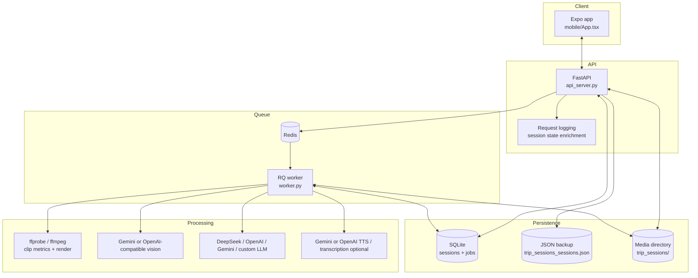
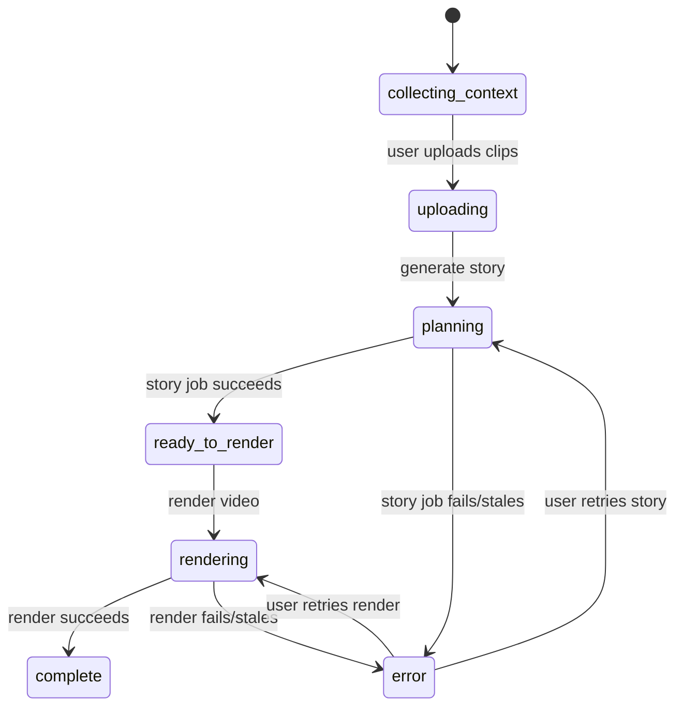
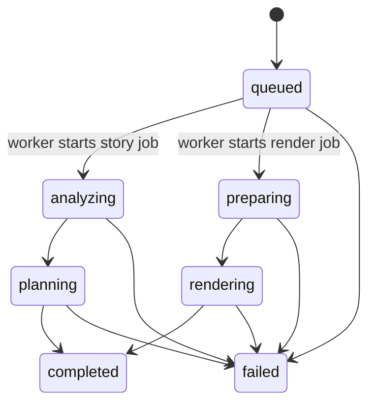
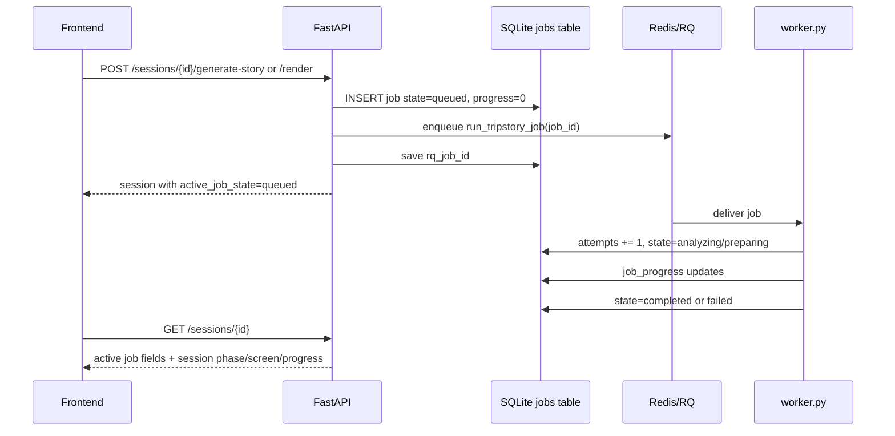

# TripStory Developer Guide

This document explains how the current TripStory workflow works, where each piece lives, and what to improve next.

## Product Goal

TripStory turns uploaded trip videos into a short social recap:

1. User enters trip context.
2. User uploads raw video clips.
3. Backend analyzes clips.
4. Gemini vision summarizes sampled video frames.
5. DeepSeek writes the story plan, edit decisions, and voiceover segments.
6. Renderer trims clips, orders them, writes captions, optionally generates narration, and exports the final video.
7. Expo web/mobile app displays the plan and final output.

The intended split is:

- DeepSeek: text reasoning, story planning, voiceover writing, edit decision planning.
- Gemini: sampled-frame visual understanding and recommended text-to-speech narration.
- OpenAI: optional speech transcription and optional text-to-speech narration.
- Local fallback: still produces a usable plan when no LLM is configured.

## Main Files

- `api_server.py`: FastAPI API, sessions, upload, planning, rendering, auth, persistence.
- `llm_provider.py`: provider abstraction for OpenAI-compatible chat APIs, including DeepSeek/Gemini/OpenAI.
- `media_intelligence.py`: video probing, OpenCV frame sampling, audio metrics, optional transcription, Gemini/OpenAI frame vision.
- `trip_story.py`: prompt contract, fallback story generation, LLM response normalization, voiceover cleanup.
- `trip_renderer.py`: ffmpeg timeline assembly, trimming, title card, captions, narration mixing.
- `tts_provider.py`: Gemini/OpenAI TTS client and ffmpeg audio mixing helper.
- `mobile/App.tsx`: Expo app UI and workflow screens.
- `mobile/src/api.ts`: frontend API client.
- `mobile/src/types.ts`: frontend TypeScript shapes.
- `tests/test_tripstory_api.py`: backend regression tests.
- `.env.example`: safe config template.
- `worker.py`: RQ worker entrypoint for story and render jobs.

## Runtime Architecture



The API and worker intentionally share the same SQLite database. The API creates sessions and job rows, while the worker updates job progress and final session output. SQLite is opened with a timeout, `busy_timeout`, and WAL mode so local API/worker concurrency is reliable enough for MVP development.



Jobs are separate from session phases:



## Environment

Use `.env` for local secrets. It is ignored by git.

Recommended AI setup:

```bash
TRIPSTORY_LLM_PROVIDER=deepseek
DEEPSEEK_API_KEY=your-real-deepseek-key
TRIPSTORY_DEEPSEEK_MODEL=deepseek-v4-pro
TRIPSTORY_DEEPSEEK_THINKING=enabled
TRIPSTORY_DEEPSEEK_REASONING_EFFORT=high
TRIPSTORY_LLM_TIMEOUT=120
TRIPSTORY_STORY_MAX_TOKENS=4096

GEMINI_API_KEY=your-real-gemini-key
TRIPSTORY_VISION_PROVIDER=gemini
TRIPSTORY_GEMINI_VISION_MODEL=gemini-2.0-flash
TRIPSTORY_ENABLE_VISION_ANALYSIS=1
```

Optional narration:

```bash
GEMINI_API_KEY=your-real-gemini-key
TRIPSTORY_TTS_PROVIDER=gemini
TRIPSTORY_TTS_MODEL=gemini-3.1-flash-tts-preview
TRIPSTORY_TTS_VOICE=Kore
```

OpenAI TTS is still supported with `TRIPSTORY_TTS_PROVIDER=openai`, `OPENAI_API_KEY`, `TRIPSTORY_TTS_MODEL=gpt-4o-mini-tts`, and an OpenAI voice such as `coral`.

Rate limiting knobs:

```bash
TRIPSTORY_LLM_MIN_INTERVAL_SECONDS=3
TRIPSTORY_LLM_MAX_RETRIES=2
TRIPSTORY_VISION_MIN_INTERVAL_SECONDS=3
TRIPSTORY_VISION_MAX_RETRIES=2
TRIPSTORY_TTS_MIN_INTERVAL_SECONDS=3
TRIPSTORY_TTS_MAX_RETRIES=2
```

Storage:

```bash
TRIPSTORY_MEDIA_DIR=trip_sessions
TRIPSTORY_SESSION_STORE=trip_sessions_sessions.json
TRIPSTORY_SESSION_DB=trip_sessions.sqlite3
TRIPSTORY_SQLITE_TIMEOUT_SECONDS=20
TRIPSTORY_MAX_UPLOAD_MB=512
```

Queue:

```bash
TRIPSTORY_QUEUE_BACKEND=rq
TRIPSTORY_REDIS_URL=redis://localhost:6379/0
TRIPSTORY_QUEUE_NAME=tripstory
TRIPSTORY_JOB_TIMEOUT_SECONDS=3600
TRIPSTORY_STALE_JOB_SECONDS=3900
```

Media subprocess limits:

```bash
TRIPSTORY_FFMPEG_PROBE_TIMEOUT=30
TRIPSTORY_FFMPEG_AUDIO_TIMEOUT=45
TRIPSTORY_FFMPEG_RENDER_TIMEOUT=300
TRIPSTORY_FFMPEG_AUDIO_MIX_TIMEOUT=300
TRIPSTORY_FFMPEG_BIN=
TRIPSTORY_FFPROBE_BIN=
```

## End-To-End Flow

### 1. Session Creation

The frontend calls the session endpoint in `api_server.py`.

The backend creates a default session with:

- `phase=collecting_context`
- `screen=context`
- default trip context
- empty `media_items`
- empty `clip_analysis`
- default render options
- default provider `deepseek`

Sessions are kept in memory and persisted to both:

- JSON backup: `trip_sessions_sessions.json`
- SQLite: `trip_sessions.sqlite3`

The SQLite table stores the whole session object as JSON. This is simple and flexible, but not ideal for production querying.

Long-running work is tracked separately in the SQLite `jobs` table. Job records store type, state, progress, current step, error, RQ id, and attempts.

### 1.1 Queue And Worker Contract

Story generation and rendering are long-running jobs. The API must not run them inside the request/response cycle when `TRIPSTORY_QUEUE_BACKEND=rq`.



The frontend spinner should always be explainable from one of these places:

- The API HTTP log for `/sessions/{session_id}`.
- The SQLite `jobs` row for the session.
- The RQ queue/started registry in Redis.
- The host process tree for the worker and child processes.

Only one worker process means one stuck job blocks every queued job behind it. Starting more workers can improve throughput, but shared SQLite and local ffmpeg/render CPU load should be considered before doing that.

### 2. Trip Context

The app saves context fields:

- destination
- duration
- places visited
- dates
- companions
- highlights
- mood
- audience
- language
- notes
- LLM provider/model override

Important: API keys are never accepted from the frontend. Keys only come from server environment variables.

### 3. Upload

Upload is handled in `api_server.py`.

Allowed video suffixes:

- `.mp4`
- `.mov`
- `.m4v`
- `.webm`

For every uploaded video:

1. File is saved under `trip_sessions/<session_id>/media/`.
2. Size and type are checked.
3. `analyze_clip()` in `media_intelligence.py` runs.
4. Analysis is stored on the media item and copied into `clip_analysis`.

### 4. Clip Intelligence

`media_intelligence.py` produces two kinds of intelligence.

Local deterministic analysis:

- duration
- width and height
- fps
- bitrate
- audio stream present
- mean/max audio levels through ffmpeg
- brightness
- sharpness
- simple motion score
- scene timestamps
- best moment timestamps
- landmark candidate timestamps
- face hits through OpenCV Haar cascade
- quality label

ffmpeg/ffprobe subprocess rules:

- Every ffmpeg/ffprobe call must use `media_tools.py` for binary resolution and must have a timeout.
- Child processes should use `-nostdin` when supported.
- Python subprocess calls that do not need input should use `stdin=subprocess.DEVNULL`.
- Audio-level probing should use `-vn` so `volumedetect` scans only audio and does not decode video frames.
- A timeout should degrade to missing metadata rather than fail the whole upload unless the caller truly needs that output.
- The renderer must not copy raw source videos as a success fallback. It should fail clearly if bounded segment rendering cannot complete, because raw phone video timestamps can create multi-hour output files.

Optional external analysis:

- OpenAI audio transcription when `TRIPSTORY_ENABLE_TRANSCRIPTION=1`.
- Gemini frame vision when `TRIPSTORY_ENABLE_VISION_ANALYSIS=1` and `GEMINI_API_KEY` is present.

Gemini vision workflow:

1. Pick timestamps from best moments, landmark candidates, or scene changes.
2. Extract up to `TRIPSTORY_VISION_MAX_FRAMES` frames.
3. Resize and JPEG-compress frames.
4. Send data URLs to Gemini through the OpenAI-compatible `/chat/completions` endpoint.
5. Ask for strict JSON:
   - `summary`
   - `visible_subjects`
   - `locations_or_scenes`
   - `actions`
   - `mood`
   - `avoid_reasons`
   - `best_moment_descriptions`

If vision fails, the backend falls back to heuristic summaries. The app should still work, but story quality is weaker.

### 5. Story Planning

Story planning is in `trip_story.py`.

The backend does not send raw `analysis` objects to DeepSeek. It first builds a compact `clip_manifest`.

Manifest example:

```text
[Clip clip1] 12s | snowy mountain trail with friends nearby | people:visible | motion:high | audio:ambient | best:4.2s,8.8s
```

The manifest keeps the information DeepSeek needs for planning:

- clip id
- duration
- creative visual cue
- people presence
- motion level
- audio hint
- best timestamps for possible edit start points
- avoid hints

The manifest intentionally drops high-token or low-value fields:

- raw JSON blobs
- resolution
- bitrate
- scene counts
- raw face detector counts
- full transcripts
- detector implementation details

This is the main token-control layer. If story generation starts getting expensive again, inspect `_clip_manifest_line()` before changing the model prompt.

The LLM is asked to return strict JSON:

- `title`
- `language`
- `tone`
- `narrative_arc`
- `voiceover_script`
- `voiceover_segments`
- `edit_notes`
- `clip_plan`
- `edit_decisions`

`edit_decisions` are the editor-facing timeline. Each item should include:

- `clip_id`
- `clip`
- `start_time`
- `duration`
- `role`
- `reason`
- `transition`
- `caption`
- `audio_strategy`

`voiceover_segments` are audience-facing narration. They must align with `edit_decisions`. Each item should include:

- `clip_id`
- `clip`
- `start_time`
- `duration`
- `voiceover`
- `caption`
- `purpose`

The backend normalizes malformed model output. If the model returns strings where arrays are expected, or wrong types for durations, the normalizer repairs those into stable shapes.

### 6. Voiceover Cleanup

The app previously produced technical voiceover like:

```text
25.19s, 1280x720, 1 scenes, strong quality, 9 face hits, audio present
```

That is now blocked in `trip_story.py`.

Technical metadata can be used in `reason` fields for edit decisions, but it must not appear in:

- `voiceover_script`
- `voiceover_segments[*].voiceover`
- captions

The cleanup detects:

- seconds like `25.19s`
- resolution like `1280x720`
- scene counts
- face hit counts
- quality labels
- `audio present`
- generic phrases like `this moment shows`

If detected, it rewrites the line into a TikTok-style narration cue based on destination, highlights, visible subjects, scenes, actions, and fallback social phrasing.

Example fallback:

```text
POV: Tromso, Norway gives you the kind of memory you want to replay: the smiles and reactions that make the trip feel alive.
```

### 7. LLM Provider

`llm_provider.py` is a small OpenAI-compatible chat client.

Provider presets:

- OpenAI: `https://api.openai.com/v1`
- Gemini: `https://generativelanguage.googleapis.com/v1beta/openai`
- DeepSeek: `https://api.deepseek.com`

Endpoint handling:

- If base URL does not end with `/chat/completions`, the client appends it.
- DeepSeek therefore posts to `https://api.deepseek.com/chat/completions`.

DeepSeek-specific payload fields:

```json
{
  "thinking": { "type": "enabled" },
  "reasoning_effort": "high"
}
```

These are controlled by:

```bash
TRIPSTORY_DEEPSEEK_THINKING=enabled
TRIPSTORY_DEEPSEEK_REASONING_EFFORT=high
```

Story generation uses `TRIPSTORY_STORY_MAX_TOKENS`, defaulting to `4096`. DeepSeek reasoning models can return HTTP 200 with an empty final `content` field when the output budget is too small for the strict JSON story plan; this is reported as an empty provider response, not as a missing key. Request timeouts and HTTP `429`/`5xx` responses are retried up to `TRIPSTORY_LLM_MAX_RETRIES`, and `TRIPSTORY_LLM_TIMEOUT` should stay high enough for reasoning responses.

The chat client serializes calls with a lock and sleeps between requests to reduce 429s.

### 8. Render

Rendering is in `trip_renderer.py`.

The renderer:

1. Builds a smart timeline from `story_plan.edit_decisions`.
2. Falls back to best detected moments if no edit decisions exist.
3. Optionally creates a title card.
4. Trims each source clip using ffmpeg.
5. Applies aspect ratio formatting.
6. Adds basic fade in/out on segments.
7. Concatenates segments.
8. Writes `edit_decisions.json`.
9. Writes SRT/VTT captions from timeline-aligned voiceover segments.
10. Synthesizes narration if TTS is configured.
11. Mixes narration under original audio.
12. Saves `story_plan.json`.

Current render outputs are stored under:

```text
trip_sessions/<session_id>/
```

Common output files:

- `holiday_recap.mp4`
- `holiday_recap_assembly.mp4`
- `voiceover.wav` for Gemini TTS or `voiceover.mp3` for OpenAI TTS
- `captions.srt`
- `captions.vtt`
- `story_plan.json`
- `edit_decisions.json`

### 9. Frontend

The Expo app in `mobile/App.tsx` has four main screens:

- Context
- Upload/media
- Plan
- Output

The UI shows:

- API connection field
- project library
- trip context form
- language and provider picker
- upload action
- clip intelligence
- story brain/provider status
- generated voiceover
- narrative arc
- smart edit decisions
- timeline/export controls
- rendered video preview

The frontend never sees provider API keys.

## How To Run

Redis:

```bash
redis-server
```

Worker:

```bash
.conda/trendsync-py312/bin/python worker.py
```

Backend:

```bash
.conda/trendsync-py312/bin/python -m uvicorn api_server:app --host 0.0.0.0 --port 8010
```

Frontend:

```bash
cd mobile
npm run web -- --clear --port 8081
```

Tests:

```bash
.conda/trendsync-py312/bin/python -m unittest discover -s tests
cd mobile
npm run typecheck
```

## Current Strengths

- Server-side API keys only.
- DeepSeek/Gemini provider split.
- Gemini frame summaries feed DeepSeek story planning.
- Fast heuristic preprocessing merges low-value scenes to optimize VLM budgets.
- Fallback path works without external LLM.
- LLM output normalization prevents many blank-page crashes.
- Voiceover metadata cleanup prevents technical narration.
- Timeline-aligned voiceover segments and captions.
- Explicit editing controls via "favorite" (pinned) and "excluded" clips.
- Render follows planned clip order/start/duration.
- Built-in Eval Dashboard metrics for checking narrative restraint.
- Story generation and rendering run through RQ + Redis jobs.
- Public sessions expose active job progress.
- Session persistence survives API restart.

## Current Limitations

- SQLite stores full session JSON, not normalized relational tables.
- The queue is local RQ + Redis, not a full production orchestration system.
- Transcription still depends on OpenAI when enabled.
- Frame understanding still depends on Gemini by default.
- TTS supports Gemini and OpenAI, but only one provider is used per render.
- Vision only samples a few frames per clip.
- Scene detection is simple histogram comparison.
- Face detection is basic Haar cascade, not modern face recognition.
- No dedicated landmark classifier.
- No music library or beat-sync editing.
- No waveform view or visual timeline editor.
- Render transitions are simple fades, not full nonlinear editing.
- Long uploads are not resumable.
- The mobile app is Expo web/mobile, not a polished native editor yet.

## Good Next Improvements

### Better Clip Intelligence

- Add local transcription with `whisper.cpp` or `faster-whisper` so short trip clips can be transcribed on CPU/GPU with zero API cost.
- Add local frame understanding with a small VLM such as Florence-2 or Moondream2 behind the same manifest interface.
- Extract thumbnails and show them in the UI.
- Sample one frame per scene, not only top-scored frames.
- Add shot boundary detection with a stronger model.
- Add speech-to-text summaries when transcription is enabled.
- Add GPS/date metadata extraction when available.
- Add object/action classification.
- Add landmark recognition.

### Better Story Planning

- Keep improving the compact manifest so DeepSeek receives dense story evidence instead of raw detector output.
- Add a second "critic" pass that checks story plan quality.
- Score each voiceover segment for audience appeal.
- Let the user choose TikTok, family archive, cinematic, funny, or documentary style.
- Add hard duration targets like 15s, 30s, 60s.

### Better Rendering

- Add local TTS with a local model such as F5-TTS or another deployable voice model.
- Add true xfade transitions.
- Burn captions into video when `burn_captions=true`.
- Add subtitle style presets.
- Add music bed selection.
- Beat-sync cuts to music.
- Normalize original clip audio before mixing narration.
- Support per-segment speed changes.
- Create mobile-first 9:16 previews by default.

### Better UX

- Add thumbnails to clip cards.
- Let user reorder clips with drag/drop.
- Let user regenerate only one segment.
- Show why a clip was selected.
- Show whether Gemini vision, heuristic analysis, or fallback was used.
- Add "new project" and "delete project" confirmations.

### Better Production Architecture

- Move from local RQ to a deployment-grade queue/worker setup when scaling beyond one machine.
- Replace JSON-in-SQLite session storage with relational tables for sessions, media items, story plans, jobs, and render artifacts.
- Add deeper render/job substates if local ASR/VLM/TTS are added.
- Store sessions/projects in Postgres for deployment.
- Store media in object storage.
- Add real user accounts.
- Add per-user project ownership.
- Add structured logs.
- Add retry state and job cancellation.
- Add deployment health checks.

## Debugging Guide

If the frontend spinner keeps running:

1. Check API logs for the latest `/sessions/{session_id}` record. The structured log should include `session_phase`, `session_progress_percent`, `active_job_state`, `active_job_step`, and `active_job_progress_percent`.
2. Check the SQLite jobs table:

```bash
sqlite3 trip_sessions.sqlite3 "select id, session_id, type, state, progress_percent, current_step, error, rq_job_id, attempts, datetime(updated_at, 'unixepoch', 'localtime') from jobs order by updated_at desc limit 10;"
```

3. Check the process tree:

```bash
ps -ef
```

4. If you need host-level process state, inspect the worker and child process with:

```bash
ps -o pid,ppid,pgid,sid,tpgid,stat,wchan:30,etime,time,cmd -p <worker_pid>,<child_pid>
```

Interpretation:

- `queued` in SQLite/RQ means the job is waiting for a worker.
- `started` in RQ plus no recent `job_progress` means the active worker is blocked or stopped.
- `STAT T` or `STAT Tl` means Linux stopped the process with a signal. This is not slow ffmpeg work; it is job control or a stop signal.
- `do_signal_stop` in `wchan` confirms the process is stopped.
- One stopped worker child blocks later queued jobs when only one RQ worker is running.

The most common local fix is to restart the worker so it loads the latest code and releases the stopped child process. Do not mark Redis or SQLite jobs manually unless you understand whether the job should be retried, failed, or abandoned.

If `ffmpeg -af volumedetect` appears slow:

- First test the exact media file outside the worker with a hard timeout:

```bash
timeout 20 .conda/trendsync-py312/bin/ffmpeg -nostdin -hide_banner -i trip_sessions/<session_id>/media/<file>.mp4 -vn -af volumedetect -f null -
```

- If this completes quickly but the worker is stuck, the issue is worker/process state, not audio analysis speed.
- Check for `STAT T`/`Tl` on worker or ffmpeg.
- Ensure the running worker has the current code. The hardened media-analysis command includes `-nostdin`, `-vn`, `stdin=DEVNULL`, and `TRIPSTORY_FFMPEG_AUDIO_TIMEOUT`.
- Renderer ffmpeg commands should also include `-nostdin`, `stdin=DEVNULL`, and `TRIPSTORY_FFMPEG_RENDER_TIMEOUT`; narration mixing uses `TRIPSTORY_FFMPEG_AUDIO_MIX_TIMEOUT`.
- Bad source video timestamps can produce warnings like `non monotonically increasing dts`; using `-vn` avoids decoding the video stream during audio-level probing.

If the Plan screen shows `FALLBACK`:

- Check `TRIPSTORY_LLM_PROVIDER`.
- Check `DEEPSEEK_API_KEY`.
- Check `TRIPSTORY_DEEPSEEK_MODEL`.
- Restart the backend after changing `.env`.
- Look at backend logs for HTTP errors.

If voiceover is generic:

- Check whether clip analysis has `semantic_source=gemini_vision`.
- If it says `heuristic`, Gemini was not used.
- Check `GEMINI_API_KEY`.
- Check `TRIPSTORY_ENABLE_VISION_ANALYSIS=1`.
- Check upload happened after the env was configured, or regenerate the plan to refresh missing semantics.

If video renders but has no narration:

- Check `TRIPSTORY_TTS_PROVIDER`.
- For Gemini TTS, check `GEMINI_API_KEY`, `TRIPSTORY_TTS_MODEL=gemini-3.1-flash-tts-preview`, and a Gemini voice such as `Kore`.
- For OpenAI TTS, check `OPENAI_API_KEY`, `TRIPSTORY_TTS_MODEL=gpt-4o-mini-tts`, and a voice such as `coral`.
- Check backend logs for TTS 429 or auth errors.
- Rendering still succeeds without narration.

If the web page is blank:

- Run `cd mobile && npm run typecheck`.
- Check browser console.
- Check API URL in the top bar.
- Restart Expo with `npm run web -- --clear --port 8081`.

If backend tests call real APIs:

- Tests should clear provider env after importing `api_server.py`.
- Keep `.env` ignored.
- Do not hard-code keys in tests.

## Code Change Checklist

Before pushing:

```bash
git status --short
.conda/trendsync-py312/bin/python -m unittest discover -s tests
cd mobile && npm run typecheck
```

Check that these are not staged:

- `.env`
- `.conda/`
- `trip_sessions/`
- `trip_sessions.sqlite3`
- `trip_sessions_sessions.json`
- `mobile/node_modules/`

Add new backend behavior tests in `tests/test_tripstory_api.py`.

Add new frontend shapes in `mobile/src/types.ts` before using them in `mobile/App.tsx`.
